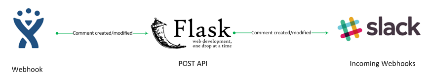
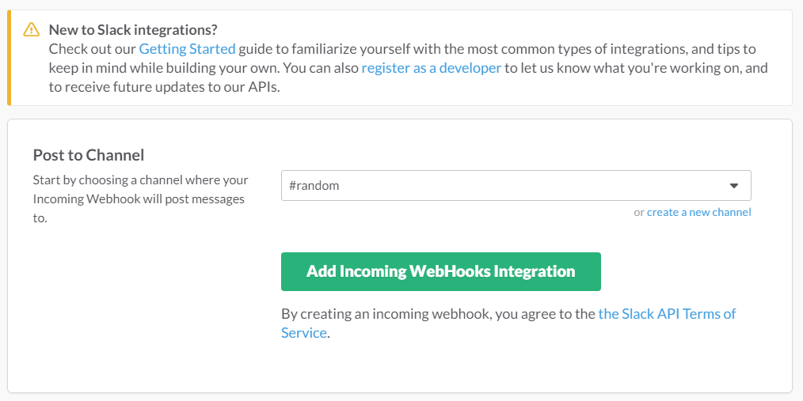
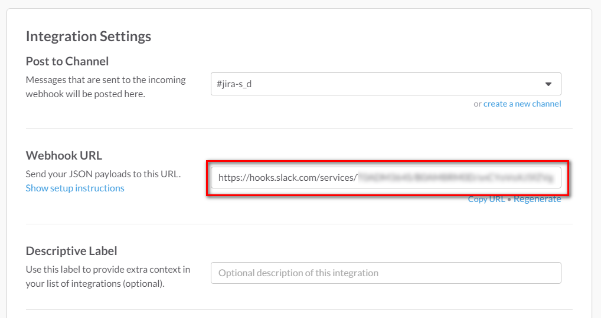
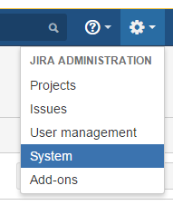
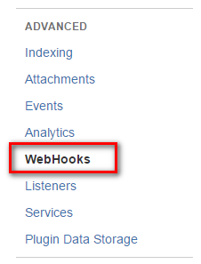
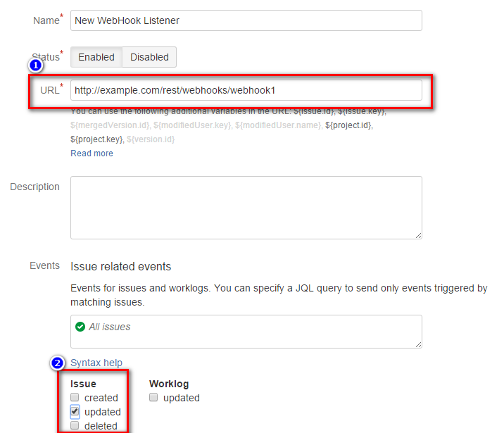
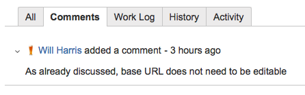
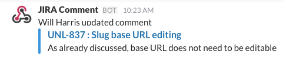

# 1. Overview



1. JIRA's comment-update event triggers a webhook to POST comment data to a configured URL.
1. Flask listens on that URL, parses the event data then POSTs it on to a configured Slack
webhook URL.
1. A configured Slack Incoming WebHook receives the JSON data from Flask and posts a comment in
the configured Slack channel.

# 2. Environment

## 1. Create Slack Incoming Webhooks info
- From the dropdown menu for your team, choose **Customize Slack**. Then from the hamburger menu choose
**Configure Apps**. Choose **Build your own** at the top right, and then under **Something just for my team**
choose **Make a Custom Integration**.

- On the **Build a Custom Integration Page** choose **Incoming Webhooks**. You can then either choose an
existing channel, or create a new channel to which messages should be posted. Click the 
**Add Incoming WebHooks Integration** button.

 

- Scroll further down the new page and you will see some additonal settings that you can make, although no
  further changes are necessary for the integration to work. **Copy the URL** so you can configure
  the server settings later.
  


## 2. API Server Configuration

Clone this Git repository to somewhere on your system. The Flask server can be run directly from the module.

```
cd /path/to/your/clone
virtualenv env
source env/bin/activate
pip install -r requirements.txt
# Server should be configured with settings - see below
python jira_comment_slack.py
```

For easier use however, the Flask server can be installed into `/usr/local/bin` using a standard
python `easy_install` setup script.

```
cd /path/to/your/clone
python setup.py install
```

The server's settings are stored in a file in the `/etc` directory. Copy the sample configuration file there...

```
cp jira_comment_slack.conf.json.example /etc/jira_comment_slack.conf
```

and edit the settings to match your requirements and the Slack webhook URL you created earlier.

    {
        "slack_url": "https://hooks.slack.com/services/XXXXXXXXX/YYYYYYYYY/zzzzzzzzzzzzzzzzzzzzzzzz",
        "channel": "#random",
    }

There are a couple of settings you may want to tweak to suit your own environment.

- `flask_host`: the hostname or IP address on which to run the Flask server. Default: 127.0.0.1
- `flask_port`: the port on which the Flask server will listen. Default: 11000

By default, the server will log to syslog using the LOG_USER facility. You may need to edit
your syslog configuration to ensure this facility generates output in a log file, but by
default on Ubuntu (for example) this should not be necessary.

If you would prefer to have logging directed to a file, you can configure a log file name:

- `flask_logfile`: a file to which any Flask logging should be directed. Default: syslog

_Note_: you should ensure that whichever user is running the server script also has permission
to write to the log file.

# 3. Run the server

If you have installed the server using `easy_install`, you can run the server directly from the command line:

```
/usr/local/bin/jira-comment-slack-server
```

In many cases you will want to run the server as a service, to ensure that it is respawned if there are any
problems or if your system reboots.

To run the server as an Upstart service on Ubuntu, copy the `jira-comment-slack-server.conf` to `/etc/init`.
By default the service is configured to run as the unprivileged user `jira`. Change this if this user
doesn't exist or you want to run it as a different user. Running as `root` is strongly discouraged for
security reasons!

# 4. JIRA Webhook Settings

You must now configure JIRA to run a webhook whenever a comment is updated.

- JIRA > System Menu



- Find the "WebHooks" setting



- Click "Create WebHook" to create a new webhook
- Enter a meaningful name such as `jira-comment-slack` and enter the URL where the Flask app is running.
If you haven't changed any of the default settings, this will be

```
http://localhost:11000/webhook
```

If you have changed the configuration of the host or port, adapt this URL to use those settings.

- Events should be set to **Issue : updated**



# 5. Working Example

### JIRA Comment capture



### `/var/log/syslog` sample output

    Jan 29 10:23:34 zeus JiraCommentSlack[5076]: INFO: As already discussed, base URL does not need to be editable

### Slack Channel message capture




# 4. Documentation / Links

* Slack Attachments --
  https://api.slack.com/docs/attachments

* Flask --
  http://flask.pocoo.org

* JIRA Webhook --
  https://developer.atlassian.com/jiradev/jira-apis/webhooks

* Ubuntu Upstart services --
  http://upstart.ubuntu.com/cookbook/

